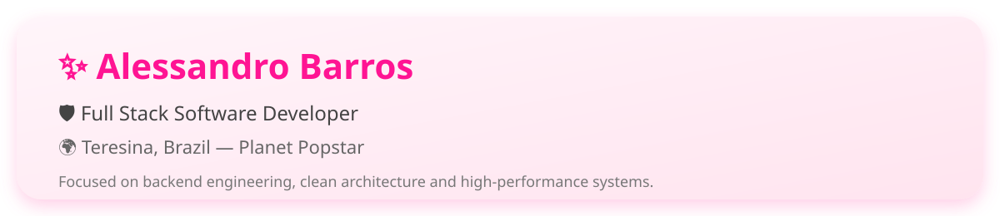
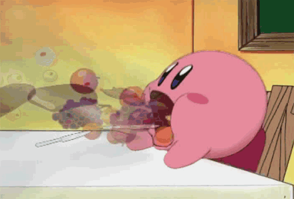
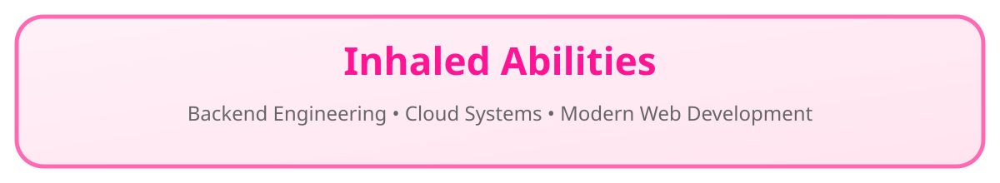
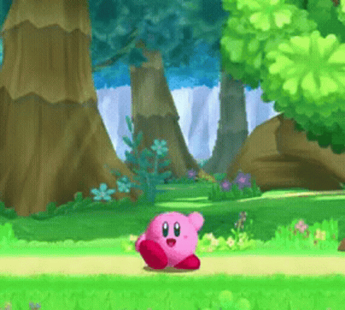
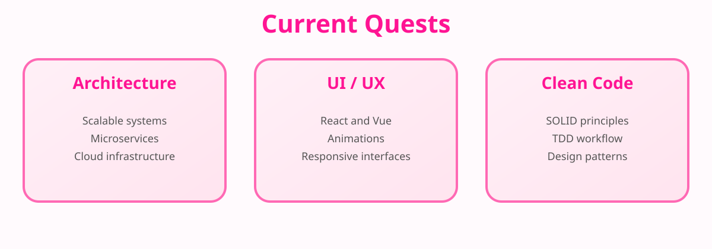

  

  

  

  <table>
<tr>
<td width="220px" align="center">

</td>

<td width="80%">

</td>
</tr>
</table>

---

  

  

# 💻 Programming Languages

  

# 🎨 Frontend Development

  

# ⚙️ Backend Engineering

  

# ☁️ Cloud and Infrastructure

  

# 🛠️ Tooling and DevOps

  

---

  

  

---

# ⭐ Star Coins & Stats

  

  

  

---

# 🍅 Contributions

  <picture>
    <source media="(prefers-color-scheme: dark)"
      srcset="https://raw.githubusercontent.com/AleBL/AleBL/pacman-output/pacman-contribution-graph-dark.svg">
    <source media="(prefers-color-scheme: light)"
      srcset="https://raw.githubusercontent.com/AleBL/AleBL/pacman-output/pacman-contribution-graph.svg">
    
  </picture>

  

  

---

# 🌠 Warp Star Network

  

  

